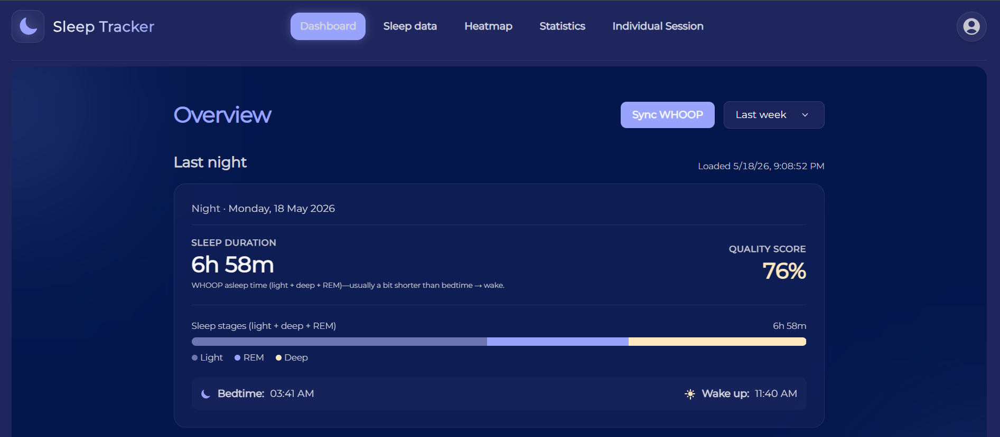
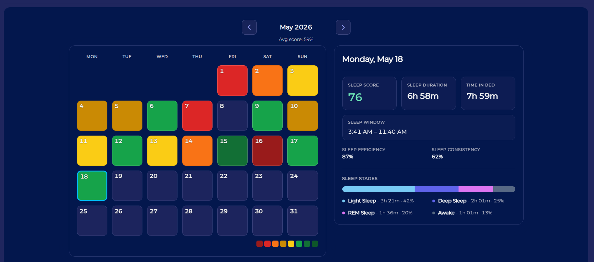
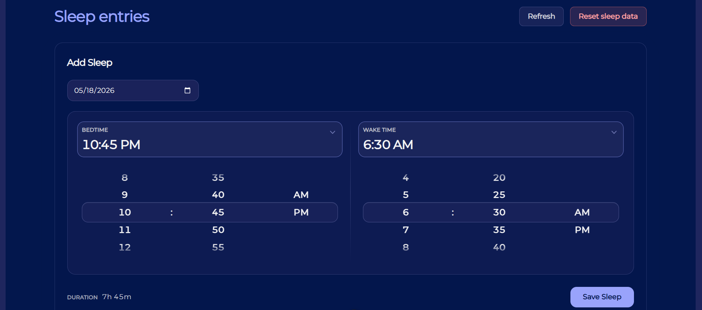
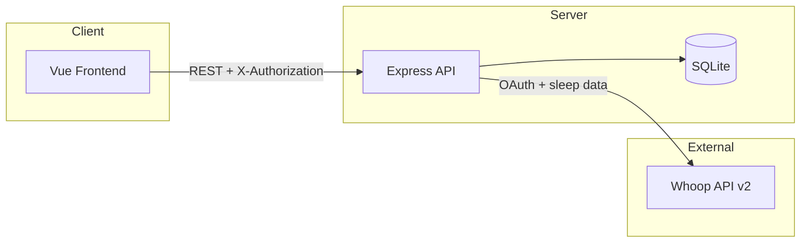

# Sleep Tracker

A full-stack sleep tracking web app that integrates with the Whoop API to sync, analyse, and visualise sleep data.

---

## Overview

Sleep Tracker lets users connect a Whoop account, import recent sleep sessions, and explore them through a dashboard, data table, and heatmap. Users can also add or edit sleep entries manually.

The app was built as a collaborative software engineering project. My focus was **backend development**: Whoop API integration, OAuth flow, data sync and normalisation, API design, and SQLite persistence, with additional contribution to **frontend** views and services.

---

## Key Features

- **Whoop OAuth2 connection flow**: connect via `/whoop/connect` and complete authorization in the Whoop callback
- **30-day sleep data sync**: imports the last 30 days from Whoop on connect and on manual sync (`GET /whoop/sleep`)
- **Token refresh handling**: refreshes expired Whoop access tokens before API calls (`GET /whoop/refresh`)
- **Sleep data normalisation**: maps Whoop API payloads into a consistent `sleep_entries` schema
- **Dashboard**: last-night summary, timeframe stats (7 / 30 days), and Whoop sync controls
- **Sleep data table**: sortable entries with stage breakdowns and session detail
- **Heatmap visualisation**: calendar-style sleep score heatmap with date range navigation
- **Manual sleep entry**: add sleep via `POST /sleep` (Add Sleep panel on Sleep Entries)
- **Mock data support**: Jest mocks for Whoop in backend tests; static sample dataset in `frontend/src/services/SleepData.js` for local UI work (not wired to live views by default)

---

## Tech Stack


| Layer               | Technologies                                               |
| ------------------- | ---------------------------------------------------------- |
| **Frontend**        | Vue 3, Vite, Vue Router, Tailwind CSS                      |
| **Backend**         | Node.js, Express.js                                        |
| **Database**        | SQLite                                                     |
| **Authentication**  | Session tokens (`X-Authorization` header); Whoop OAuth2    |
| **API integration** | Whoop API v2                                               |
| **Tools**           | GitHub, Postman, Swagger UI (`/api-docs`), Jest, Supertest |


---

## Screenshots

### Dashboard

Overview of recent sleep with last-night summary, stage breakdown, timeframe filters (night / 7 days / 30 days), and Whoop connection and sync controls.



### Heatmap

Calendar heatmap of sleep performance scores by day, with month navigation and a side panel for the selected date.



### Manual Entry

Add Sleep form on the Sleep Entries page: pick date and bed/wake times to log a session without Whoop.



---

## System Architecture

1. The **Vue frontend** (port `5173`) calls the **Express API** (port `3333`) with a session token after login.
2. The API reads and writes **SQLite** (`sleep_entries`, `users`, `whoop_tokens`).
3. For Whoop operations, the backend exchanges OAuth codes, stores tokens, and calls the **Whoop API**; results are normalised and persisted locally.




---

## API Overview

Base URL (local): `http://localhost:3333`

Protected routes require header: `X-Authorization: <session_token>` (returned from login).


| Method   | Endpoint               | Description                                                       |
| -------- | ---------------------- | ----------------------------------------------------------------- |
| `GET`    | `/`                    | Health check: returns `{ "status": "Alive" }`                     |
| `GET`    | `/dbhealth`            | Database connectivity check                                       |
| `GET`    | `/api-docs`            | Swagger UI documentation                                          |
| `POST`   | `/user/create_account` | Register a new user                                               |
| `POST`   | `/user/login`          | Login; returns session token                                      |
| `POST`   | `/user/logout`         | Logout (authenticated)                                            |
| `GET`    | `/user/info`           | Get user info by session token                                    |
| `GET`    | `/whoop/connect`       | Get Whoop OAuth authorization URL (authenticated)                 |
| `GET`    | `/whoop/callback`      | Whoop OAuth callback; stores tokens and redirects to frontend     |
| `GET`    | `/whoop/status`        | Whoop connection status for current user                          |
| `GET`    | `/whoop/refresh`       | Refresh Whoop access token (authenticated + Whoop token required) |
| `GET`    | `/whoop/sleep`         | Sync last 30 days of sleep from Whoop into SQLite                 |
| `GET`    | `/whoop/sleep-history` | List stored sleep entries for the current user                    |
| `GET`    | `/sleep`               | List sleep entries (authenticated)                                |
| `POST`   | `/sleep`               | Create a manual sleep entry                                       |
| `GET`    | `/sleep/:id`           | Get one sleep entry                                               |
| `PATCH`  | `/sleep/:id`           | Update a sleep entry                                              |
| `DELETE` | `/sleep/:id`           | Delete a sleep entry                                              |
| `DELETE` | `/sleep/reset`         | Delete all sleep entries for the current user                     |
| `GET`    | `/test`                | Simple test route                                                 |


---

## Database Overview

SQLite database file: `backend/app/utils/sleeptracker.db` (created on first run).


| Table             | Purpose                                                    |
| ----------------- | ---------------------------------------------------------- |
| **users**         | Accounts, salted passwords, and session tokens             |
| **sleep_entries** | Normalised sleep sessions (Whoop-synced and manual)        |
| **whoop_tokens**  | Per-user Whoop `access_token`, `refresh_token`, and expiry |


`.env` files and `*.db` database files are **excluded from Git** (see `.gitignore`). Do not commit secrets or local databases.

---

## Installation

### Prerequisites

- Node.js 20+ (see `frontend/package.json` engines)
- npm
- Whoop developer app credentials ([Whoop Developer Dashboard](https://developer.whoop.com/))

### Steps

```bash
git clone <https://github.com/khaledhusain/sleep-tracker-whoop>
cd sleep-tracker-whoop
```

**Frontend**

```bash
cd frontend
npm install
npm run dev
```

Runs at `http://localhost:5173`.

**Backend** (separate terminal)

```bash
cd backend
npm install
```

Create `backend/.env` (see [Environment Variables](#environment-variables)), then:

```bash
npm run dev
```

Runs at `http://localhost:3333`. Swagger: `http://localhost:3333/api-docs`.

---

## Environment Variables

Create `backend/.env` from the template below. **Never commit real secrets.**

```env
# Server (API listens on port 3333 by default)
HTTP_PORT=3333

# Whoop OAuth2
WHOOP_CLIENT_ID=your_whoop_client_id
WHOOP_CLIENT_SECRET=your_whoop_client_secret
WHOOP_REDIRECT_URI=http://localhost:3333/whoop/callback
```

Register the redirect URI exactly as configured in the Whoop developer portal.

---

## Testing / Development Notes

- **Postman**: used to exercise REST endpoints and Whoop-related flows during development.
- **Jest + Supertest**: backend tests under `backend/test/`; run from `backend`:
  ```bash
  npm test
  ```
  Reset DB and run tests (Unix/macOS):
  ```bash
  npm run clean-test
  ```
- **Whoop mocks**: unit tests mock `whoopClient` and models so CI/local runs do not require live Whoop data.
- **SQLite**: local file-based DB; ignored by Git. Delete `sleeptracker.db` to reset data.
- **Mock UI data**: `frontend/src/services/SleepData.js` holds static sample sessions for prototyping if needed.

---

## Future Improvements

- More advanced sleep trend analysis
- Improved deployment setup (e.g. hosted frontend + API)
- Richer visual analytics and charts
- Clearer user-facing errors when Whoop sync or token refresh fails
- Mobile responsiveness polish across views

---

## Project Status

This project is currently being polished as a **portfolio version** of a university team project.

---

## Team

Built with Isaac Rideal, Ellis Ollier, Joshua Roberts, Favour Omoregie, and Grace Blakeburn.